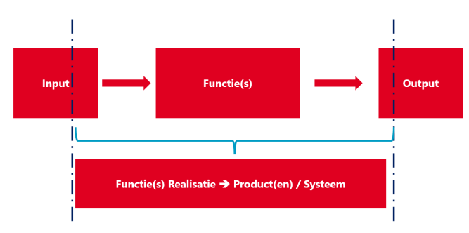

 
 <h1>Architecture Document </h1>
 <h2>1. Functie, Product, Systeem</h2>
 
Algemene voorstelling van ons project.

<h2>2. Input/output lijst</h2>

| Inputs            | Outputs |
| -------           | ------- 
|On/Off Button      |LED battery indicator
|Start Button       |Display
|Select button      |Sound
|Play buttons (4) (shoulder buttons, joypad, normal buttons)            |refrigeration
|Charge Input       |
|USB Input          |
|Battery Indicator  |
|AUX (Uitbreiding)  |

<h2>3. Direct/Indirect functions</h2>

|Direct   | Indirecte
|------   | ---------
|Audio    | USB-c Voeding
|Emulator | 3D-Print behuizing
          | Battery

<h2>4. Architectuur</h2>

<h2>5. I/O overzicht </h2>
<h2>6. Power overzicht</h2>
