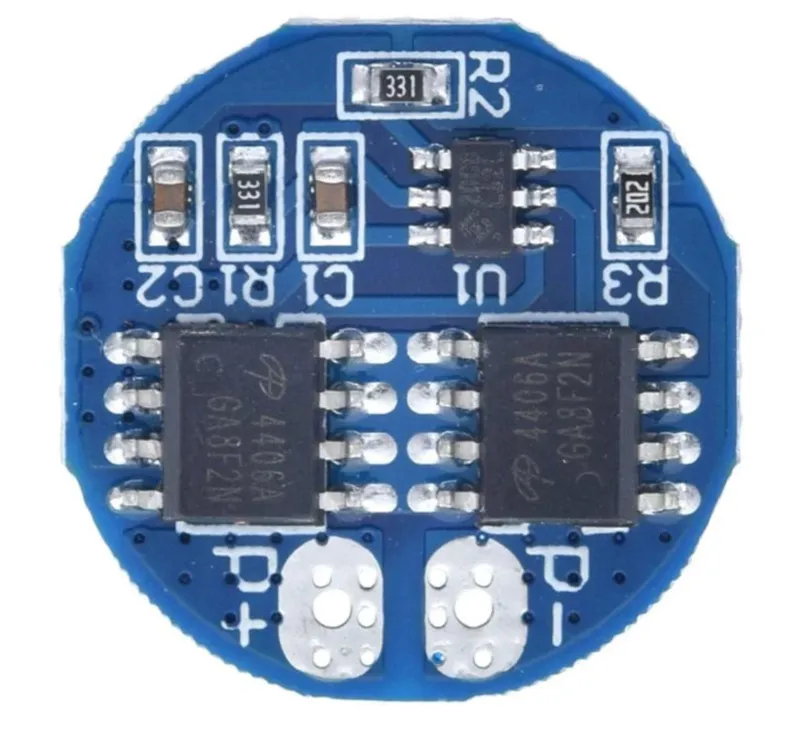

# Componentenkeuze

## 1. Koeling

</img>

We hebben gekozen voor voor zeer kleine ventilatoren voor koeling. Aangezien we niet veel plaats hebben in de retropie is dit ideaal. We hebben 2 verschillende soorten besteld kleinere,  en iets grotere met als voordeel dat de grotere ventilatoren een grotere inhoud kan koelen. We zullen op de batterij koelen en 

We hebben ook een heatsink gekocht om de warmte van de cpu af te voeren.

## 2. Batterij

We hebben deze batterij gekozen omdat we dit goed kunnen plaatsen aan de zijkant kunnen plaatsen van onze retropie. We hebben ook genoeg capaciteit aangezien we 2 batterijen parallel plaatsen wat uitkomt op 5200mAh.

## 3. Speaker

Hier hebben we gewoon gekeken naar wat er in de behuizing zou passen dus mocht het niet te dik zijn.

## 4. BMS

We hebben gekozen om een BMS bordje te kopen voor het opladen van de batterij. De reden hiervoor is dat batterijen opladen heel delicaat is en veel kennis nodig heeft. Dit bordje is een goede oplossing het is een battery management system en het beschermd tegen te diepe ontlading en overlading.

## 5. Step down converter

Ingangsspanning: 3,5 - 35 VDC
Uitgangsspanning: 5 - 55 VDC (instelbaar)
Max. ingangsstroom: 3 A
We hebben deze component gekozen omdat dit de specificaties zijn die we nodig hebben voor onze pi.

