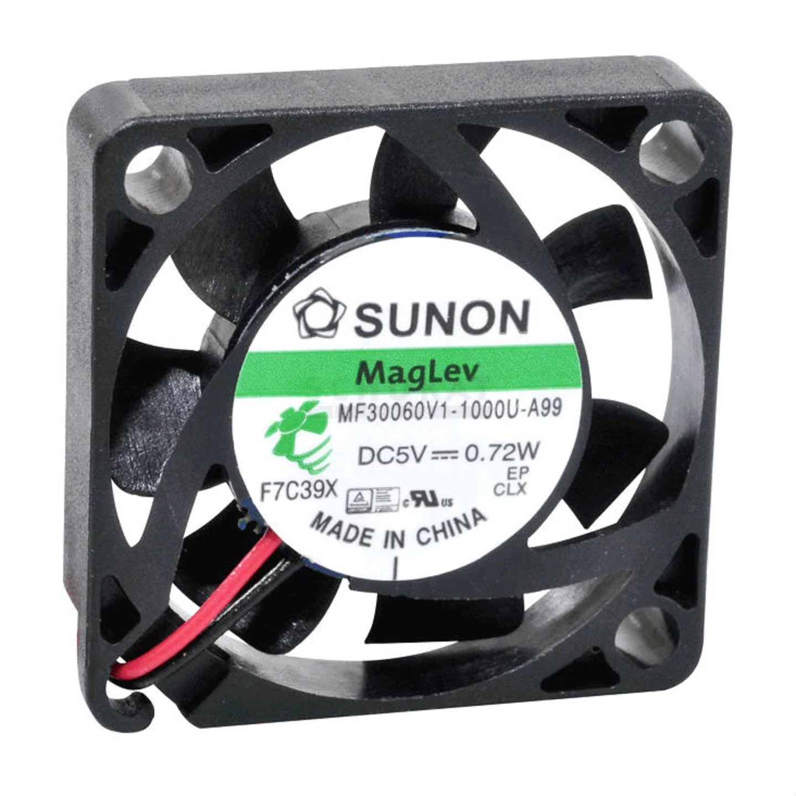
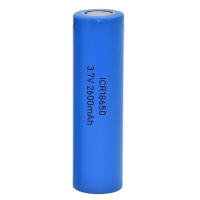
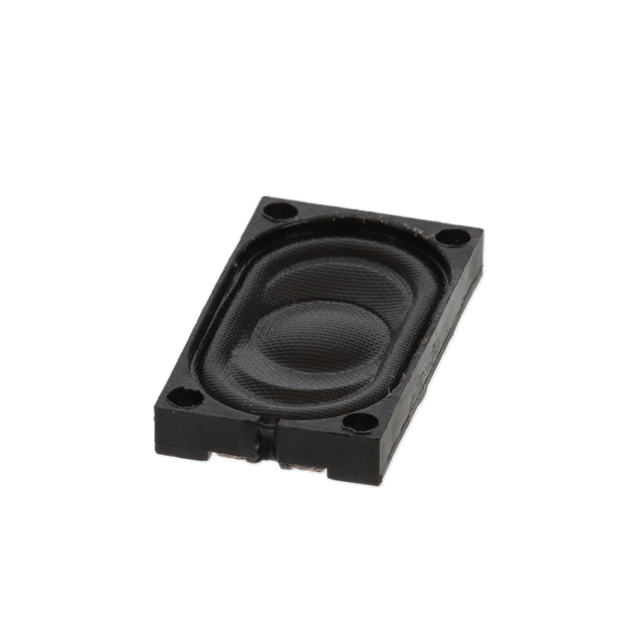
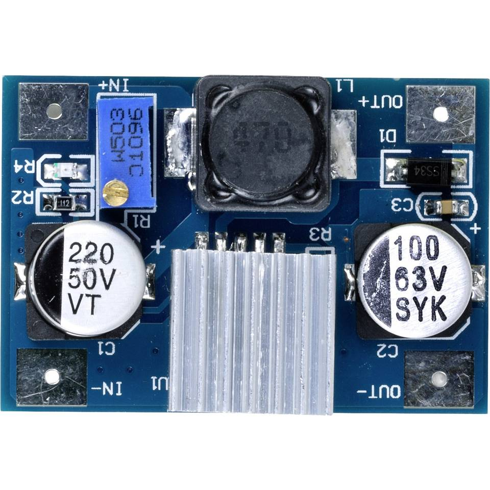

# Componentenkeuze

## 1. Koeling

</img>

We hebben gekozen voor voor zeer kleine ventilatoren voor koeling (20x20x10mm). Aangezien we niet veel plaats hebben in de retropie is dit ideaal. Er zullen 3 fans aanwezig zijn, 2 voor de batterijen en 1 voor de processor.

</img>

We hebben ook een heatsink gekocht om de warmte van de cpu af te voeren.

## 2. Batterij

We hebben de 18650 batterijzn gekozen omdat deze niet veel plaats innemen en een grote capaciteit hebben, we zullen van deze batterijen 2 groepen van 2 in serie zetten. De 2 groepen zullen in parallel staan, hierdoor verdubbelen we de spanning en de capaciteit.

## 3. Speaker

We hebben gekozen voor een 8ohm + 1 watt speaker, dit door het compacte formaat. We zullen hier 2 van gebruiken in de retropie.

## 4. BMS

De Bms zorgt voor het even ontladen van de batterijen in serie. Dit is belangrijk voor de veiligheid.

## 5. Step down converter

Ingangsspanning: 3,5 - 35 VDC
Uitgangsspanning: 5 - 55 VDC (instelbaar)
Max. ingangsstroom: 3 A
We hebben dit component gekozen omdat onze spanning van de batterijen te hoog is, deze converter zal de spanning omzetten naar 5V, dit is bruikbaar voor al onze componenten.

## 6. Buttons

We hebben soft-touch buttons gekozen

## 7. Amplifier

