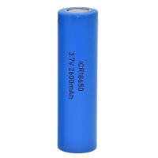
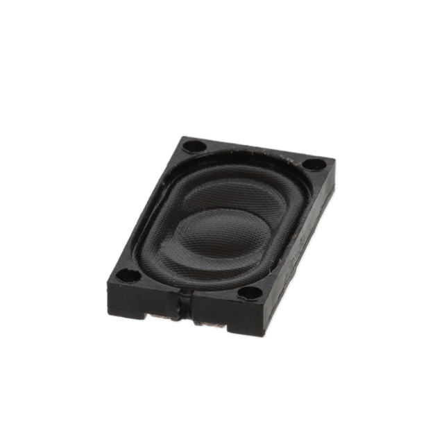
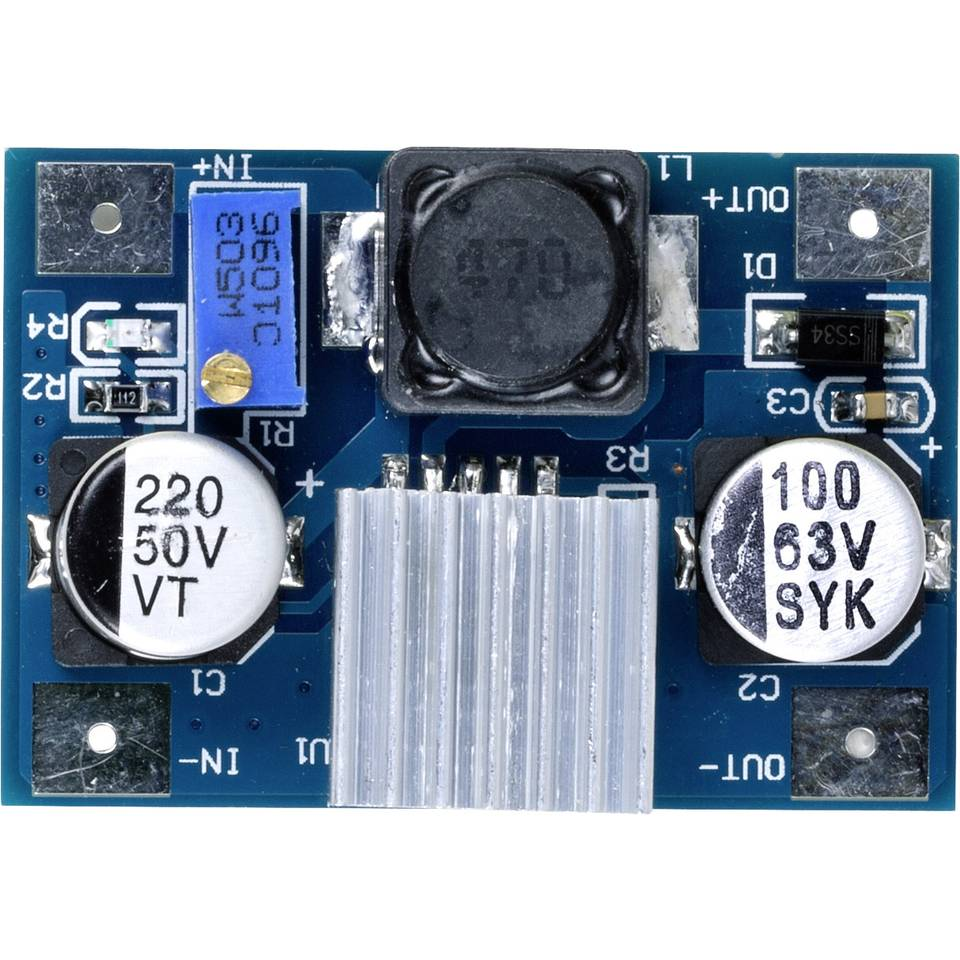
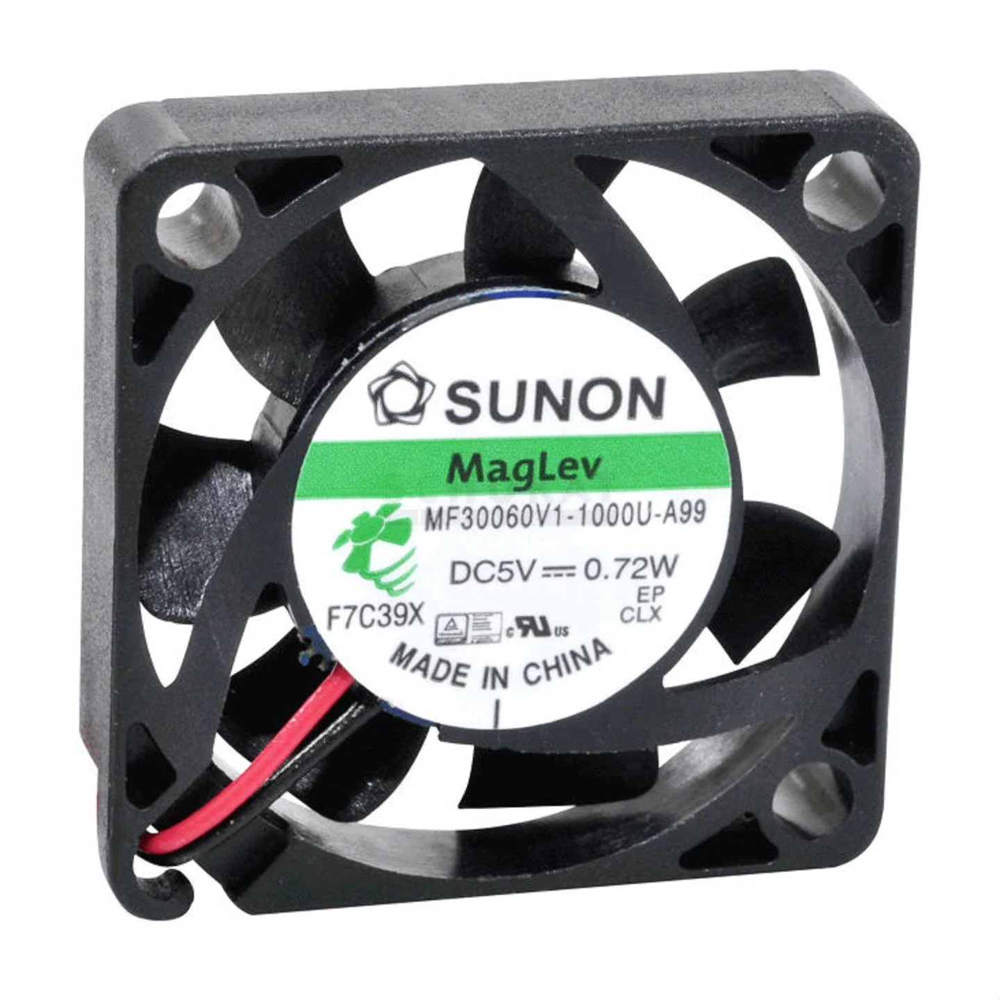

# Componentenkeuze

## 1. Rasberry Pi4 model B

## 2. Batterij

We hebben de 18650 batterijen gekozen omdat deze niet veel plaats innemen en een grote capaciteit hebben, we zullen van deze batterijen 2 groepen van 2 in serie zetten. De 2 groepen zullen in parallel staan, hierdoor verdubbelen we de spanning en de capaciteit.

## 3. Speaker

We hebben gekozen voor een 8ohm + 1 watt speaker, dit door het compacte formaat. We zullen hier 2 van gebruiken in de retropie. Elk aan een kant van de retropie.

## 4. Step down converter

Ingangsspanning: 3,5 - 35 VDC
Uitgangsspanning: 5 - 55 VDC (instelbaar)
Max. ingangsstroom: 3 A
We hebben dit component gekozen omdat onze spanning van de batterijen te hoog is, deze converter zal de spanning omzetten naar 5V, dit is bruikbaar voor al onze componenten.

## 5. Koeling

</img>

We hebben gekozen voor voor zeer kleine ventilatoren voor koeling (20x20x10mm). Aangezien we niet veel plaats hebben in de retropie is dit ideaal. Er zullen 3 fans aanwezig zijn. Deze worden gestuurd door een PWM signaal, beïnvloed door de ingebouwde temp sensor van de raspberry.

</img>

We hebben ook een heatsink gekocht om de warmte van de cpu af te voeren.

## 6. PCB

## 7. Temp-sensor

Deze is ingebouwd in de raspberry, en zal de temperatuur van de processor gaan bekijken en het PWN signaal gaan beïnvloeden.

## 8. 3D-prints

Wij zullen vooral PLA prints gebruiken, maar voor een doorzichtige achterkant te creëren zullen wij PETG gebruiken

## 9. On/off switch

We gebruiken hier een switch gebruiken in de vorm van een drukknop. Dit wordt geschakeled tussen de batterijen en de rest van de schakeling.

## 10. Leds

De leds zullen gebruikt worden in het battery level indicator systeem.

## 11. Weerstanden

We zullen weerstanden gebruiken in de battery level indicator, en de amplifiers.

## 12. Condensators

Deze worden gebruikt in de amplifier.

## 13. Amplifier IC

Het geluid wordt hier versterkt zodat het bruikbaar wordt, terwijl het in een kleine vormfactor blijft.

## 14. Buttons

We hebben soft-touch buttons gekozen. Hierop zullen wij ge-3d printe buttons op monteren.

## 15. Display

Een 5inch scherm wordt gebruikt als output. Deze is vast gemonteerd aan onze raspberry pi.

## 16. HDMI to micro-HDMI

De raspberry pi 4 heeft een micro-hdmi aansluiting, het scherm die we gebruiken kan je hiermee makkelijk aansluiten via de hmdi poort die voorzien is.

